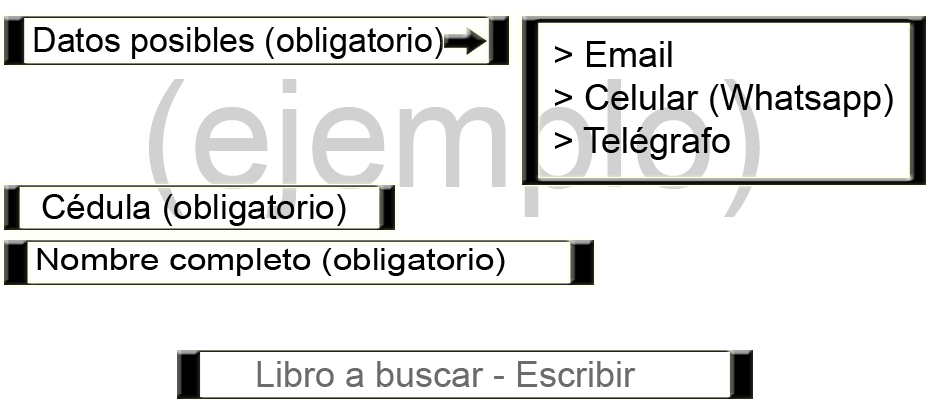
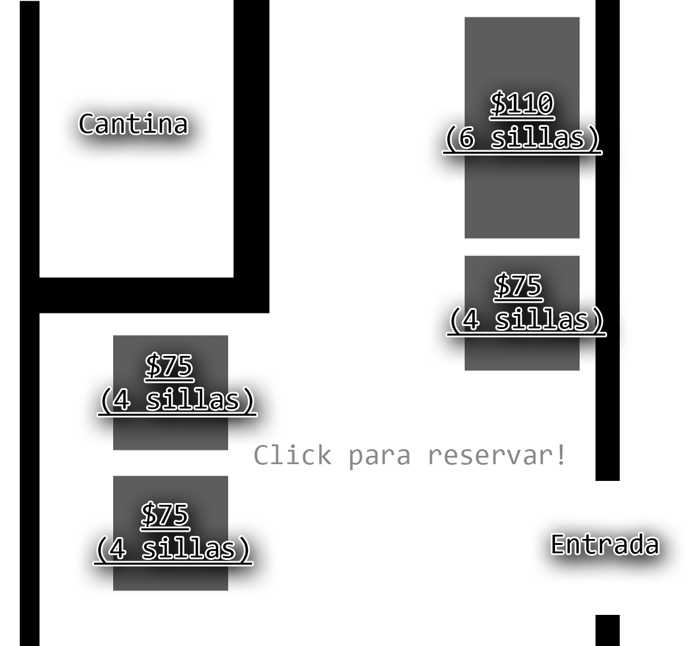

# :boom: Project W.E.V :boom:
<b>W</b>eb 
<b>E</b>fectivamente 
<b>V</b>eloz 

Projecto de dibujo con el propósito de mejorar la comunicación de información entre los sistemas del liceo y las personas 
a través de diseño de páginas que faciliten el acceso a la manipulación de la información. En lo que se centrará el proyecto sobre todo el
proyecto es en mejorar a tráves de diseño de páginas web la cantina y la bibloteca. 

## :warning: Bibloteca :warning:

Sabemos que siempre para buscar libros o buscar sobre su disponibilidad tenemos que ir a la bibloteca a una hora que este abierta
y preguntar, y si no es el caso esperar o buscar otra manera de conseguir el libro o dato. 
Lo que proponemos con nuestro sistema es poder acceder de una manera más eficiente a los datos de la disponibilidad de libros y al
poder reservarlos a cierto horario, con una página donde se enviaran preguntas del email de la página a la bibloteca, donde
aparecerán datos varios de seguridad y importantes importados por el usuario.

<big><b>Boceto protótipo para preguntar por la disponibilidad:</b></big>

## :warning: Cantina :warning:

La cantina como sabemos tiene un menú del día el cuál tenes que preguntar por para reservarlo o ver cuál es, lo que podemos
encontrar un poco tedioso, además a veces encontramos que puedas de las mesas y sillas de la cantina están ocupadas muchas veces,
por lo que proponemos hacer con nuestro sistema es agregar una forma de reservar comida de forma más cómoda, de preguntar el menú
del día y de reservar mesas para estudiar o comer en grupo o solo.

<big><b>Boceto protótipo de reservar mesas cantina:</b></big>

## :warning: Comunicados (esta por verse) :warning:

No estamos de que tengamos el tiempo y capacidad necesaria para hacer este sistema, pero se trataría de una página, extensión,
o app por la cuál se pueda mandar comunicados, notificaciones de cosas que sucedan en el liceo directamente a los celulares
o dispositivos conectados en forma de notificación formal junto a un artículo en la página, el hacer esto requiere mucho más
infraestructura de lo que se piensa, lo más posible es que mostremos una demo de tal función simplemente (capaz no).
